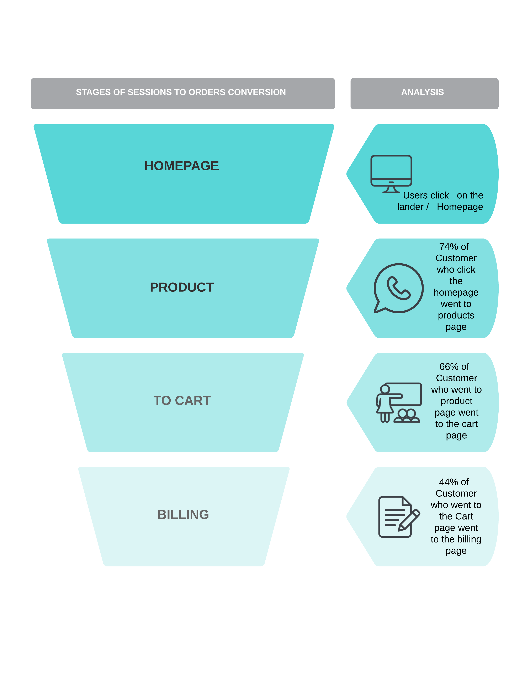

# Marketing-Data-Analyst-Project
Real World Marketing Ecommerce Data Analyst Project Using SQL Server Management Studio-

Some Insights from the analysis:
Traffic Source Analysis: 

• Determined that desktop users have a 3.8 times higher conversion rate from web sessions to orders 
 compared to mobile users.

Bounce Rate Analysis:

• Analyzed top-entry webpages based on web sessions, revealing a bounce rate of 60%.

Conversion Funnel Analysis: 

• Created and analyzed the conversion funnel from the homepage to the billing page, discovering an 
 8% customer drop-off between the products page and the billing page.

.Customer Behavior Analysis:

• Identified repeat customers and analyzed their spending habits and trends, finding that their 
 conversion rate and revenue is 2% higher than that of one-time customers.

Diagram of the Ecommerce Conversion Funnel Analysis

